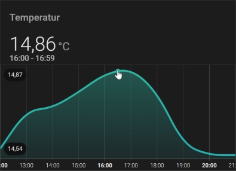
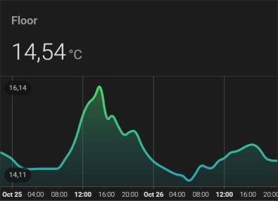
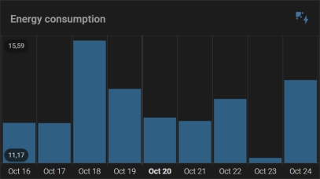
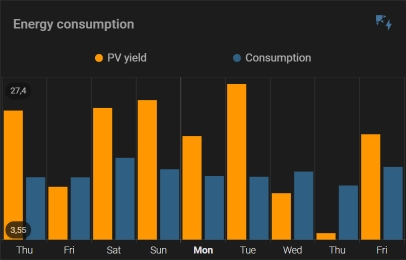
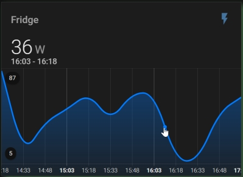
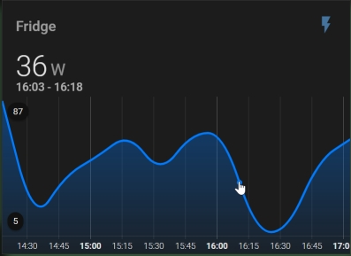
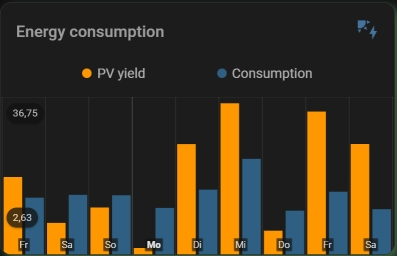
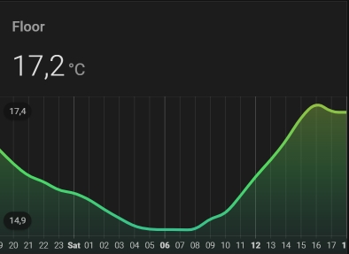
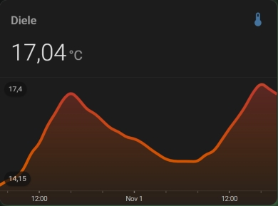

# Labels, ticks and grid lines for x axis


## Enabling Labels and Gridlines



You can add labels and grid lines for the x axis. 

```yaml
type: custom:mini-graph-card
name: Floor
entities:
  - entity: sensor.motion_eingang_temperature
    name: Temperatur
show:
  x_labels: true
  x_lines: true
hours_to_show: 10
group_by: hour
```

The x_scale option provides the maximum number of labels and lines for the x-axis. This is 10 by default. The x_major_breaks option specifies the major or thick lines every n-th label/line (per default every 4-th). 
The following figure shows a finer grid and highlight every 3th mark (label, tick, line). You can play around with x_scale and x_major_breaks.



```yaml
type: custom:mini-graph-card
name: Floor
entities:
  - entity: sensor.motion_eingang_temperature
    name: Temperatur
show:
  x_labels: true
  x_lines: true
hours_to_show: 48
x_scale: 12
x_major_breaks: 3
group_by: hour
card_mod:
  style: |
    .x_lines.--thin {
      visibility: hidden;
    }
```

The minor/thin lines are hidden by card-mod.

<br/>

## X-axis and Bars

When grouped by date the X-axis labels are aligned with bar. 



You can override the default time format for date by setting the x_format option days to weekday with style 'short'.



```yaml
type: custom:mini-graph-card
name: Energy
entities:
  - entity: sensor.pv_energy_yield
    name: PV yield
  - entity: sensor.energy_consumption
    name: Consumption
show:
  graph: bar
  x_labels: true
  x_lines: true
hours_to_show: 216
group_by: date
x_format:
  days:
    weekday: short
```

Monday is highlighted as first day of week.

<br/>

## Grouped by interval

When grouped by interval the time scale for the X-axis ends with the current time.



```yaml
type: custom:mini-graph-card
name: Kühlschrank Power
entities:
  - entity: sensor.plug_power
    name: Fridge
show:
  fill: fade
  x_labels: true
  x_labels_fill: true
  x_lines: true
hours_to_show: 3
points_per_hour: 4
x_scale: 12
x_major_breaks: 4
```

The show option x_labels_fill extends the fill into the X-axis area.

You can align to the time scale (full hour) by prefixing the option x_scale with a minus.



```yaml
type: custom:mini-graph-card
name: Kühlschrank Power
entities:
  - entity: sensor.plug_power
    name: Fridge
show:
  x_labels: true
  x_labels_fill: true
  x_lines: true
hours_to_show: 3
points_per_hour: 4
x_scale: -12
x_major_breaks: 4
```

<br/><br/>

## Other options

### Move labels into graph area



```yaml
show:
  graph: bar
  x_labels: true
  x_labels_inline: true
  x_lines: true
hours_to_show: 216
group_by: date
x_format:
  locales: locale
  days:
    weekday: short
```

### Define time format for labels



```yaml
show:
  x_labels: true
  x_labels_fill: true
  x_lines: true
hours_to_show: 24
x_scale: 24
x_major_breaks: 6
group_by: hour
x_format:
  locales: en-US
  hours:
    hour: 2-digit
  days:
    weekday: short
```

Default time format:
```yaml
x_format:
  locales: en-US
  hours:
    hour: 2-digit
    minute: 2-digit
  days:
    month: short
    day: numeric
```


### Use card-mod to adapt appearance



```yaml
show:
  x_labels: true
  x_labels_fill: true
  x_lines: true
hours_to_show: 36
x_scale: 10
x_major_breaks: 3
group_by: hour
card_mod:
  style: |
    ha-card {
      box-shadow: 5px 5px 10px #3d6642;
    }
    .graph .graph__container
    .x_labels {
      font-size: calc(.15em + 11px);
    }
    .graph .graph__container
    .x_labels.--thick {
      font-weight: 300;
    }
    .x_labels.--thin {
      visibility: hidden;
    }
    .x_labels.--axis {
      stroke-width: 2;
    }
    .x_ticks.--thick {
      stroke-width: 1.5;
    }
    .x_ticks.--thin {
      stroke-width: 1.5;
    }
    .x_lines.--thick {
      visibility: hidden;
    }
    .x_lines.--thin {
      visibility: hidden;
    }
    .x_lines.--top {
      stroke-width: 2;
    }
```
