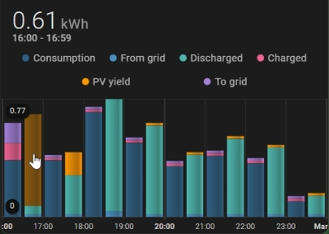

# Labels, ticks and grid lines for X-axis


## Enabling Labels and Gridlines


You can add labels and grid lines for the X-axis. 

```yaml
type: custom:mini-graph-card
name: Floor
entities:
  - entity: sensor.motion_eingang_temperature
    name: Temperatur
show:
  x_labels: true
  x_lines: true
hours_to_show: 10
group_by: hour
```

The x_scale option provides the maximum number of labels and lines for the X-axis. This is 10 by default. The x_major_breaks option specifies which lines/labels among all lines/labels are drawn thick (per default every fourth mark). 
The following figure shows more labels and highlight every third mark (label, tick, line). You can play around with x_scale and x_major_breaks.


```yaml
type: custom:mini-graph-card
name: Floor
entities:
  - entity: sensor.motion_eingang_temperature
    name: Temperatur
show:
  x_labels: true
  x_lines: true
hours_to_show: 48
x_scale: 12
x_major_breaks: 3
group_by: hour
card_mod:
  style: |
    .xlines--thin {
      visibility: hidden;
    }
    .xlines__top {
      visibility: visible;
    }

```

The minor/thin lines are hidden by card-mod.

<br/>

## X-axis and Bars

Bars with X-axis are supported.



When grouped by date the X-axis labels are aligned with bar. 


You can override the default time format for date by setting the option days in x_format to weekday with style 'short'.


```yaml
type: custom:mini-graph-card
name: Energy
entities:
  - entity: sensor.pv_energy_yield
    name: PV yield
  - entity: sensor.energy_consumption
    name: Consumption
show:
  graph: bar
  x_labels: true
  x_lines: true
hours_to_show: 216
group_by: date
x_format:
  days:
    weekday: short
```

Monday is highlighted as first day of week.

<br/>

## Grouped by interval

When grouped by interval the time scale for the X-axis ends with the current time.


```yaml
type: custom:mini-graph-card
name: Kühlschrank Power
entities:
  - entity: sensor.plug_power
    name: Fridge
show:
  fill: fade
  x_labels: true
  x_labels_fill: true
  x_lines: true
hours_to_show: 3
points_per_hour: 4
x_scale: 12
x_major_breaks: 4
```

The show option x_labels_fill extends the fill into the X-axis area.

You can align to the time scale (full hour) by prefixing the option x_scale with a minus.


```yaml
type: custom:mini-graph-card
name: Kühlschrank Power
entities:
  - entity: sensor.plug_power
    name: Fridge
show:
  x_labels: true
  x_labels_fill: true
  x_lines: true
hours_to_show: 3
points_per_hour: 4
x_scale: -12
x_major_breaks: 4
```

<br/><br/>

## Other options

### Move labels into graph area


```yaml
show:
  graph: bar
  x_labels: true
  x_labels_inline: true
  x_lines: true
hours_to_show: 216
points_per_hour: 1
group_by: date
x_format:
  locales: locale
  days:
    weekday: short
```

### Define time format for labels


```yaml
show:
  x_labels: true
  x_labels_fill: true
  x_lines: true
hours_to_show: 24
x_scale: 24
x_major_breaks: 6
group_by: hour
x_format:
  locales: en-US
  hours:
    hour: 2-digit
  days:
    weekday: short
```

Default time format:
```yaml
x_format:
  locales: en-US
  hours:
    hour: 2-digit
    minute: 2-digit
  days:
    month: short
    day: numeric
```


### Use card-mod to adapt appearance


```yaml
show:
  x_labels: true
  x_labels_fill: true
  x_lines: true
hours_to_show: 36
x_scale: 10
x_major_breaks: 3
group_by: hour
card_mod:
  style: |
    ha-card {
      box-shadow: 5px 5px 10px #3d6642;
      border-radius: 0px;
    }
    .graph .graph__container
    .xlabels {
      font-size: 0.9em;
    }
    .xlabels--thick {
      font-weight: 400 !important;
     }
    .xlabels--thin {
      visibility: hidden;
    }
    .xlabels__axis {
      stroke-width: 2 !important;
    }
    .xlabels__tick {
      visibility: hidden;
    }
    .xlines {
      visibility: hidden;
    }
    .xlines--thick {
      visibility: hidden;
    }
    .xlines--thin {
      stroke: grey !important;
    }
    .xlines__line {
      stroke-width: 0.5 !important;
    }
    .xlines__top {
      stroke-width: 2.5 !important;
    }
```